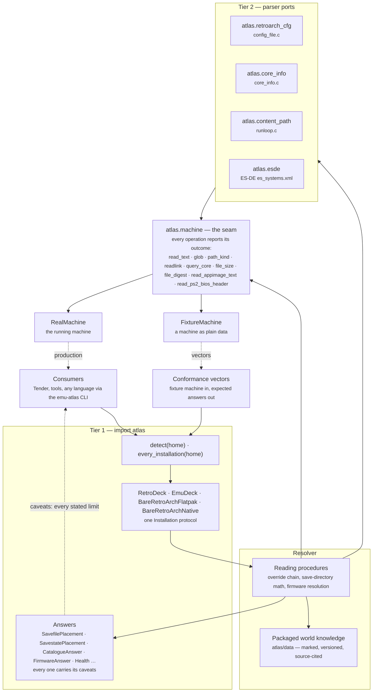
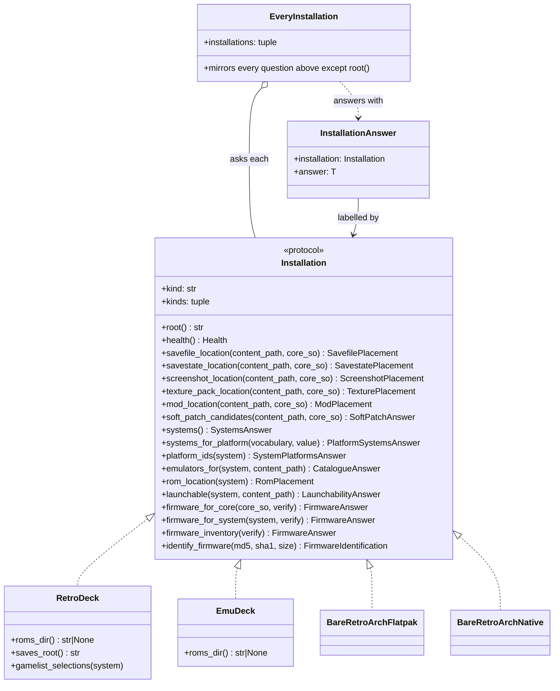

# Architecture — the map

**Stand: 2026-08-20** — the platform crosswalk, the AppImage seam, the CLI and the launcher route. This document is
updated with the surface: it describes what is there today, and a change to the API is expected to change it. The spec
is `DESIGN.md` — that one says why. This one says what is where.

## The layers

One code path, two data sources: production and the conformance vectors run the same resolver, and differ only in which
machine is behind the seam.

## The handles and the aggregate

Every question is asked _of an installation_. `EveryInstallation` asks all of them and labels each answer with the
handle that produced it — fan-out only, no merging and no preference.

RetroDECK always answers from a frontend catalogue, and EmuDeck does while an ES-DE is on its disk — including the
bundled layer inside the ES-DE AppImage, which atlas reads itself (`atlas.squashfs`) wherever the runtime has the
image's codec, and states as sealed where it does not; the handles without a catalogue answer the question with a stated
refusal rather than an empty list. "Bare" is the arrangement axis (a RetroArch nobody configured for a frontend);
"standalone" is the emulator axis (an emulator without a libretro core) — the two never mix. A standalone entry resolves
through a packaged save card where one covers the emulator the command names (by `%EMULATOR_…%` token, or on EmuDeck by
the launcher script the command runs); everything else refuses typed.

## The answers

Structured fields are contractual; prose (`sources`, caveat messages, `*provenance`) is not. Three subjects carry a
summary field, marked `«summary»` — a fact the subject establishes by combining its own fields.

```mermaid
classDiagram
    class SavefilePlacement {
        +dir: str
        +root_kind: RootKind
        +needs: tuple
        +file_set: FileSet
        +granularity: Granularity
        +fallback_dir / physical_dir
        +caveats: tuple~Caveat~
    }
    class SavestatePlacement {
        +dir: str
        +root_kind: StateRootKind
        +needs: tuple
        +file_set: FileSet
        +fallback_dir / physical_dir
        +caveats: tuple~Caveat~
    }
    class TexturePlacement {
        +dir: str
        +needs: tuple
        +enabled: bool|None
        +keying: Keying|None
        +physical_dir: str|None
        +caveats: tuple~Caveat~
    }
    class ModPlacement {
        +trees: tuple~ModTree~
        +needs: tuple
        +enabled: bool|None
        +caveats: tuple~Caveat~
    }
    class ModTree {
        +role: str|None
        +dir: str
        +physical_dir: str|None
        +keying: Keying|None
    }
    class SoftPatchAnswer {
        +candidates: tuple~SoftPatchCandidate~
        +applies: bool|None
        +caveats: tuple~Caveat~
    }
    class SoftPatchCandidate {
        +format: PatchFormat
        +path: str
        +continuations: tuple
        +attempted: bool|None
    }
    class FileSet {
        +state: FileSetState
        +files: tuple
        +complete: bool
    }
    class Health {
        +issues: tuple~Caveat~
        +ok: bool «summary»
    }
    class CatalogueAnswer {
        +entries: tuple~EmulatorEntry~
        +caveats: tuple~Caveat~
    }
    class RomPlacement {
        +dir: str|None
        +physical_dir: str|None
        +extensions: tuple
        +caveats: tuple~Caveat~
    }
    class EmulatorEntry {
        +system / label / kind / core_so
        +savefile_location(content_path)
        +savestate_location(content_path)
        +texture_pack_location(content_path)
        +mod_location(content_path)
    }
    class FirmwareAnswer {
        +root: str
        +cores: tuple~CoreFirmware~
        +unclaimed: tuple
        +hash_checked: bool
        +caveats: tuple~Caveat~
    }
    class CoreFirmware {
        +declaration: CoreDeclarationState
        +requirements: tuple~FirmwareRequirement|FirmwareAlternatives~
        +refused / unread
        +requirements_met: bool|None «summary»
    }
    class FirmwareRequirement {
        +file_name / path / declared
        +need: FirmwareNeed
        +found: PathKind
        +checked: FirmwareChecked
        +regions: tuple|None
        +satisfied: bool|None «summary»
    }
    class FirmwareAlternatives {
        +options: tuple~FirmwareRequirement~
        +satisfied: bool|None «one of these, the console region decides»
    }
    class ScreenshotPlacement {
        +dir: str
        +root_kind: ScreenshotRootKind
        +needs: tuple
        +physical_dir: str|None
        +caveats: tuple~Caveat~
    }
    class SystemsAnswer {
        +systems: tuple
        +caveats: tuple~Caveat~
    }
    class PlatformSystemsAnswer {
        +vocabulary / value
        +platforms: tuple
        +matches: tuple~PlatformSystemMatch~
        +caveats: tuple~Caveat~
    }
    class SystemPlatformsAnswer {
        +system / status / tags_source
        +platforms: tuple
        +identities: tuple~PlatformIdentities~
        +caveats: tuple~Caveat~
    }
    class LaunchabilityAnswer {
        +verdict: str
        +extension / accepted / alternatives
        +entry: EmulatorEntry|None
        +caveats: tuple~Caveat~
    }
    class Caveat {
        +code: str
        +data: Mapping
        +message: str
    }
    class Unresolved {
        +code: str
        +data: Mapping
    }

    SavestatePlacement *-- FileSet
    SavestatePlacement *-- Caveat
    SavefilePlacement *-- FileSet
    SavefilePlacement *-- Caveat
    TexturePlacement *-- Caveat
    ModPlacement *-- ModTree
    ModPlacement *-- Caveat
    SoftPatchAnswer *-- SoftPatchCandidate
    SoftPatchAnswer *-- Caveat
    CatalogueAnswer *-- EmulatorEntry
    CatalogueAnswer *-- Caveat
    RomPlacement *-- Caveat
    EmulatorEntry ..> SavefilePlacement : savefile_location()
    EmulatorEntry ..> SavestatePlacement : savestate_location()
    EmulatorEntry ..> TexturePlacement : texture_pack_location()
    EmulatorEntry ..> ModPlacement : mod_location()
    EmulatorEntry ..> Unresolved : standalone emulator
    FirmwareAnswer *-- CoreFirmware
    CoreFirmware *-- FirmwareRequirement
    CoreFirmware *-- FirmwareAlternatives
    FirmwareAlternatives *-- FirmwareRequirement
    Health *-- Caveat
```

## What to import from where

| You are…                        | You import                                                                                               |
| ------------------------------- | -------------------------------------------------------------------------------------------------------- |
| writing a client                | `import atlas` — entry points, handles, answers, vocabularies, serializers                               |
| branching on a field's value    | `import atlas` — every closed set a field can hold, values and types alike                               |
| writing a test or a fixture     | `from atlas.machine import FixtureMachine`                                                               |
| porting the resolver            | the Tier-2 modules, as the reference for what each parser reads                                          |
| reading a cfg / catalogue alone | `from atlas.retroarch_cfg import …`, `from atlas.esde import parse_es_systems`                           |
| validating your own system map  | `import atlas` — `from_esde_system`, `known_systems`                                                     |
| arriving from a platform id     | the two platform questions on any handle; `from atlas.platforms import …` for the raw identity table     |
| checking packaged knowledge     | `from atlas.oddities import lookup_card`, `from atlas.textures import …`, `from atlas.evidence import …` |

The rule behind the table: if a client acts on it, it is in `atlas`; if it exists so a port or a test can reproduce the
resolver, it lives in its module. `DESIGN.md`'s "The two tiers" carries the reasoning.
